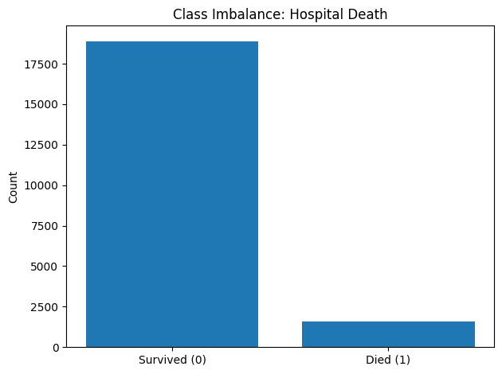
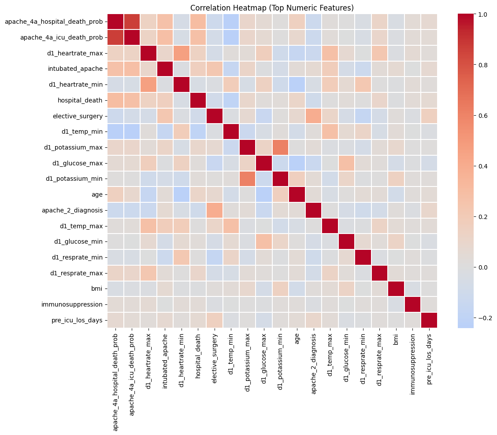
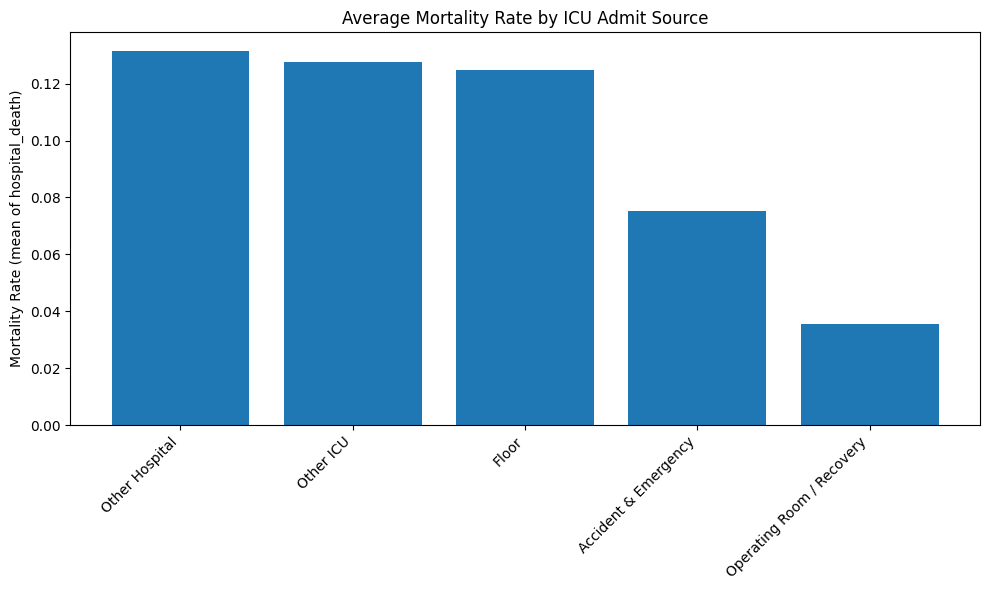
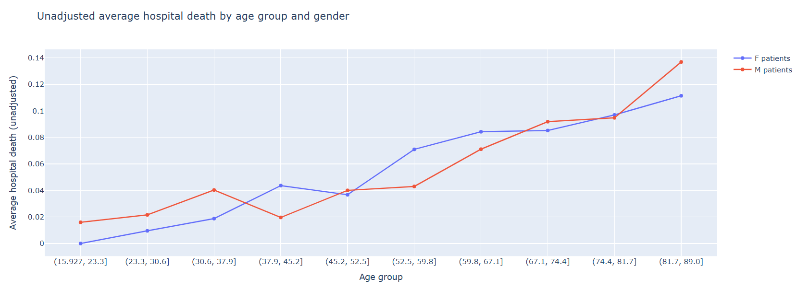
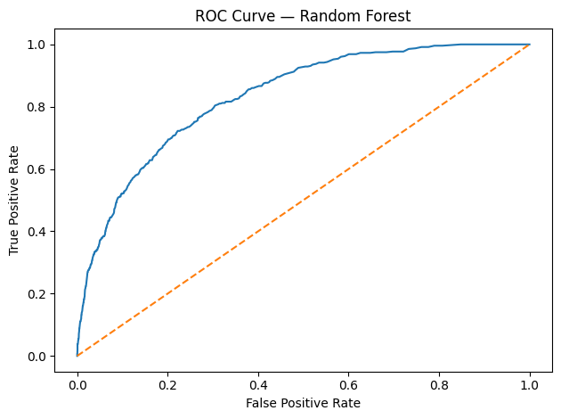
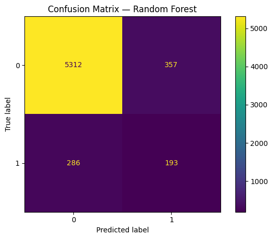
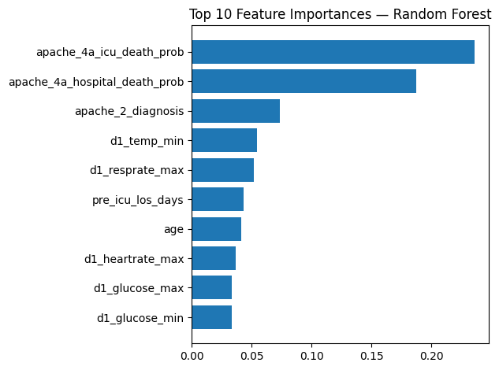

# ICU Mortality Prediction for Diabetic Patients

This project demonstrates an end-to-end machine learning workflow to predict
hospital mortality risk for diabetic patients admitted to Intensive Care Units (ICUs),
using clinical data available within the first 24 hours of admission.

The project focuses on:

- Handling real-world class imbalance
- Feature selection to reduce overfitting
- Proper model evaluation for imbalanced data
- Interpreting results for applied, industry-relevant ML use cases

⚠️ Disclaimer: This project is for educational and portfolio demonstration
purposes only and is not intended for clinical use.

# Workflow

1. Problem Statement
2. Dataset Overview
3. Exploratory Data Analysis (EDA)
4. Data Preprocessing
5. Handling Class Imbalance
6. Feature Selection
7. Model Training
8. Model Evaluation
9. Key Insights & Limitations
    

## 1. Problem Statement

Diabetic patients admitted to ICUs face an elevated risk of mortality.
Early identification of high-risk patients within the first 24 hours of ICU admission can support timely interventions and better allocation of critical care resources.

Objective:
Develop a machine learning model that predicts hospital mortality (binary outcome) for diabetic ICU patients using early demographic, clinical, and laboratory data.

## 2. Dataset Overview

Source: Kaggle – ICU Patient Survival Prediction dataset
Population: Adult ICU patients diagnosed with diabetes
Records used: ~20,000 ICU admissions
Target variable: hospital_death (0 = survived, 1 = died)

The dataset contains:

- Patient demographics
- ICU admission and stay details
- Vital signs and laboratory results from the first 24 hours
- Chronic health condition indicators

  

## 3. Exploratory Data Analysis (EDA)

EDA was performed to understand:

- Data types and distributions
- Missing value patterns
- Target class imbalance
- Correlations among key numeric variables
- Mortality trends by ICU admission source and by age & gender

EDA insights were used to inform preprocessing decisions, but no features were removed at this stage to avoid biasing exploratory analysis. These are some of the results from EDA.

### Class Imbalance in Target

This plot highlights the strong class imbalance in the target variable, motivating the use of SMOTENC during model training.

### Correlation Structure of Key Clinical Variables

The heatmap reveals correlations among key numeric features and supports the need for feature selection to reduce redundancy.

### Mortality Rate by ICU Admission Source

### Mortality Trends by Age Group and Gender

Mortality risk increases with age and shows mild variation across genders, consistent with clinical expectations.

## 4. Data Preprocessing

Preprocessing was designed to prepare the data for modeling while minimizing information leakage.

Key steps included:

- Separation of features (X) and target (y)
- Identification of categorical vs numeric features
- Missing-value handling using a tiered policy:
  *Features with very high missingness were removed
  *Moderately missing features were augmented with missingness indicators
  *Remaining missing values were imputed (mean for numeric, mode for categorical)
- Encoding categorical features using Ordinal Encoding
(compatible with SMOTENC and tree-based models)

These steps ensured consistency and robustness for downstream modeling.

## 5. Handling Class Imbalance

The dataset exhibits a strong class imbalance, with mortality cases forming a minority of observations.

To address this:

- SMOTENC (Synthetic Minority Over-sampling Technique for mixed data types) was applied
- Resampling was performed only on the training set to prevent data leakage

This approach improves model learning while preserving the integrity of the test set.

## 6. Feature Selection

To reduce overfitting and improve interpretability, a filter-based feature
selection method was applied.

- Method: ANOVA F-test using SelectKBest
- Feature selection was fitted only on the training data
- A fixed number of top-ranked features was selected for modeling

This approach balances predictive performance with model simplicity and stability.

## 7. Model Training

The following supervised learning models were trained and compared:

- K-Nearest Neighbors (KNN)
- Decision Tree
- Random Forest

Key training practices:

- 70/30 stratified train–test split
- Feature selection and class balancing applied only to training data
- Consistent random state for reproducibility

Based on comparative performance, the Random Forest model was selected as the final model for evaluation and interpretation.

## 8. Model Evaluation

Models were compared using metrics appropriate for imbalanced classification.
Feature selection and class balancing were applied only on the training data.

### Model Performance Comparison

| Model | CV ROC AUC | Test ROC AUC |
|------|------------|--------------|
| K-Nearest Neighbors | 0.95 | 0.60 |
| Decision Tree | 0.92 | 0.61 |
| **Random Forest** | **0.99** | **0.83** |

Based on generalization performance on the test set, **Random Forest** was selected
as the final model.

### ROC Curve (Random Forest)

### Confusion Matrix (Random Forest)

### Feature Importance (Top 10)

## 9. Insights & Conclusion

### Key Insights
- Random Forest achieved the best balance between discrimination and generalization
- Handling class imbalance was critical for meaningful performance
- Training performance was higher than test performance, reflecting realistic generalization behavior
- The ROC curve demonstrates the model's ability to distinguish between survival and mortality, as the curve lies well above the random baseline, indicating higher predicted risk scores for patients who died compared to those who survived across classification thresholds.
- The confusion matrix shows strong performance in identifying survivors (higher true negatives); however, the presence of false negatives and fewer true positives indicates that some high-risk patients are missed. In real clinical settings, this trade-off would require threshold tuning or cost-sensitive learning to prioritize recall of mortality cases.
- Early physiological measurements (such as heart rate, respiration rate, temperature, and glucose levels) were more predictive of ICU mortality than static chronic condition indicators, suggesting that acute patient status plays a larger role in short-term outcomes.

### Limitations
- Single public dataset (no external validation)
- Static snapshot of first 24 hours (no temporal modeling)
- Results are not intended for direct clinical deployment

